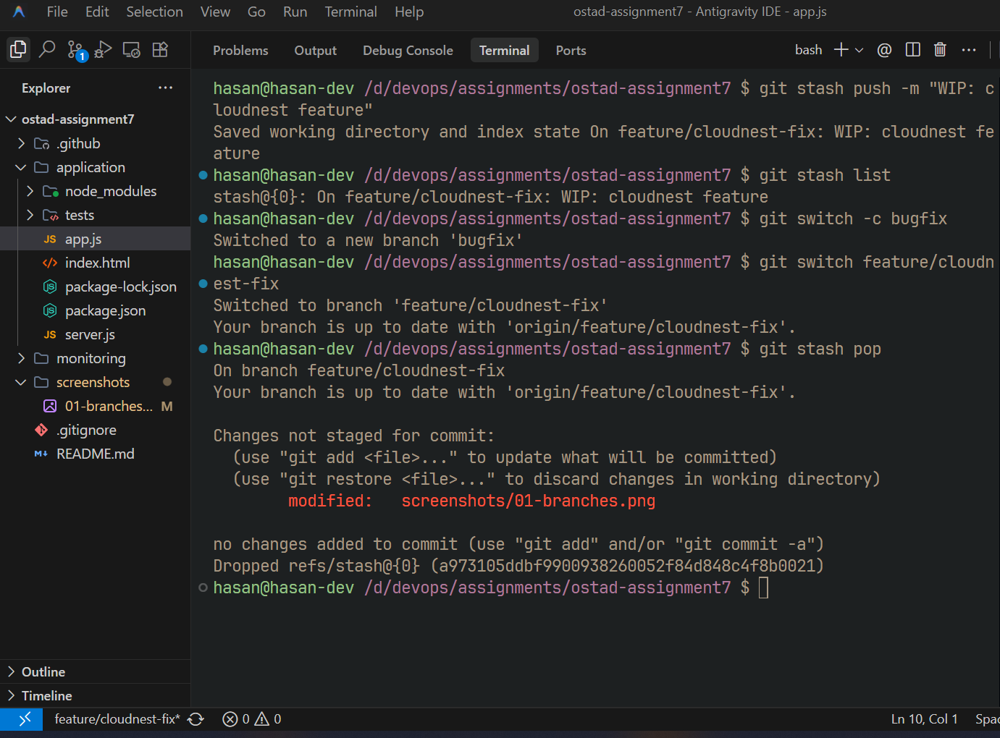
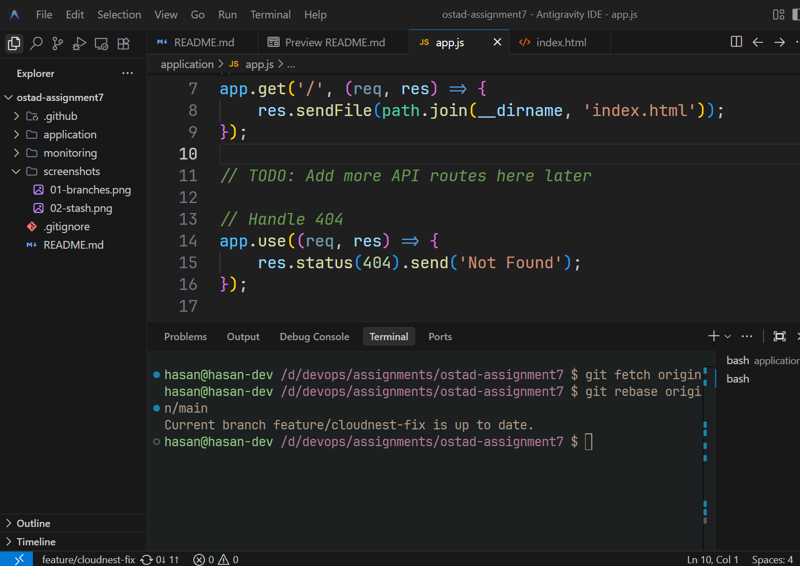
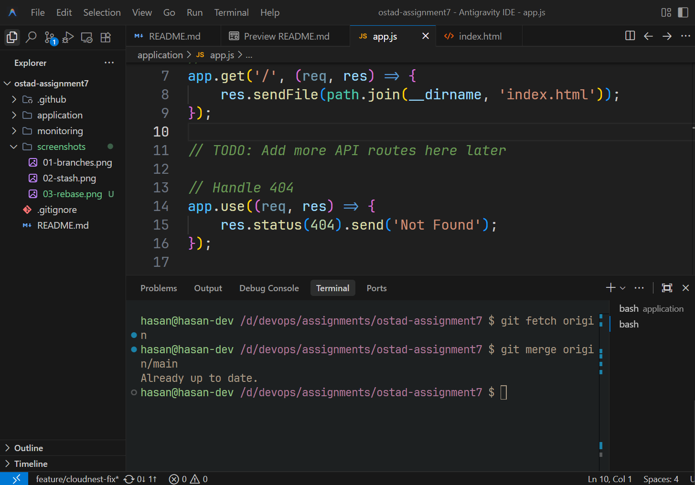
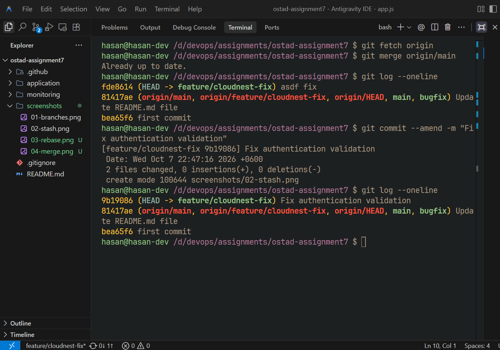
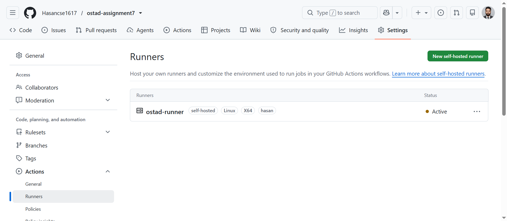
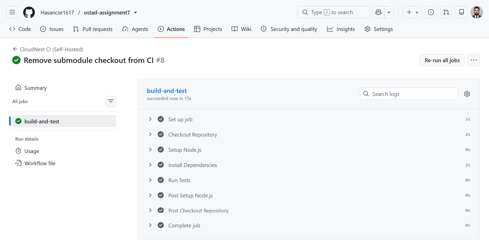
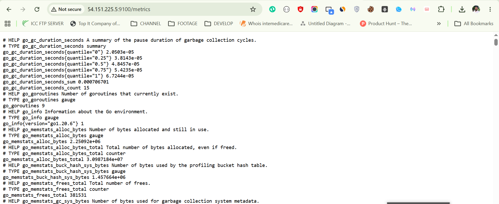
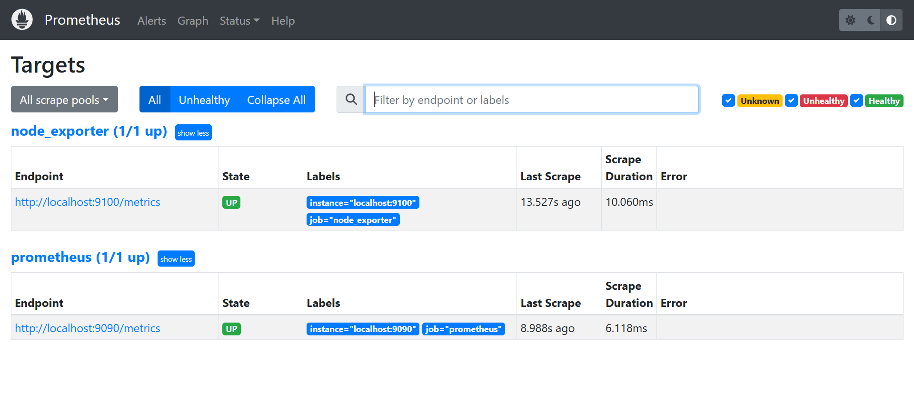
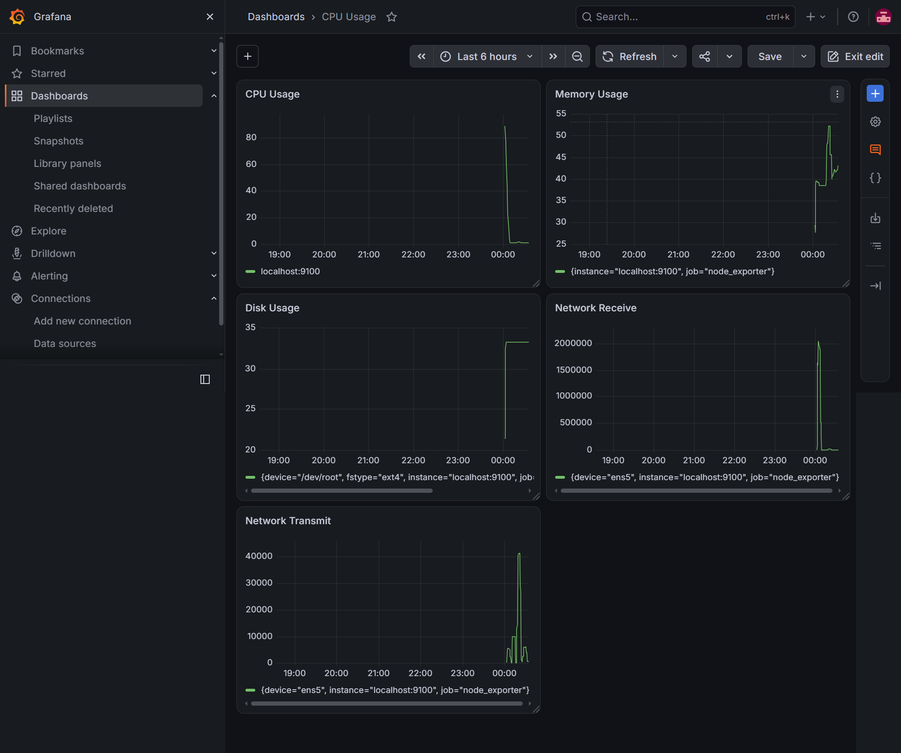

# Ostad Batch 14 — Assignment 7

# The Friday Night Fix — CloudNest DevOps Challenge

---

## 📌 Assignment Information

- **Name:** Md Hasan Ali
- **Course:** DevOps
- **Batch:** Ostad Batch 14
- **Assignment:** The Friday Night Fix
- **Challenge:** CloudNest DevOps Challenge

---

# 📖 Project Overview

CloudNest is a small startup facing several development and infrastructure problems before an important client demo.

The project requires solving seven real-world DevOps scenarios involving:

* Git branching and workflow
* Git Stash
* Git Rebase
* Git Merge
* Git commit history cleanup
* Self-hosted GitHub Actions runner
* Automated CI pipeline
* Server monitoring
* Prometheus
* Node Exporter
* Grafana
* Custom monitoring dashboard

The goal of this project is to demonstrate a practical DevOps workflow using tools that can be controlled and maintained by the organization itself.

---

# 🎯 Project Objectives

The main objectives of this assignment are:

1. Keep feature development separate from the main branch.
2. Temporarily save unfinished work using Git Stash.
3. Demonstrate both Rebase and Merge workflows.
4. Correct an incorrect Git commit message.
5. Build a CI pipeline using a self-hosted GitHub Actions runner.
6. Monitor server health using Prometheus and Node Exporter.
7. Create a custom Grafana dashboard for server monitoring.

---

# 🏗️ Architecture

## CI Architecture

```text
                    Developer
                        │
                        │ git push
                        ▼
                 ┌───────────────┐
                 │    GitHub     │
                 │  Repository   │
                 └───────┬───────┘
                         │
                         │ GitHub Actions
                         ▼
              ┌──────────────────────┐
              │  Self-Hosted Runner  │
              │    Ubuntu Server     │
              └──────────┬───────────┘
                         │
                 ┌───────┴───────┐
                 │               │
              Install           Test
             Dependencies        │
                 │               │
                 └───────┬───────┘
                         │
                       Build
                         │
                         ▼
                    CI Success
```

---

## Monitoring Architecture

```text
              Ubuntu Server
                   │
                   │
             Node Exporter
                   │
                   │ Metrics
                   ▼
              Prometheus
                :9090
                   │
                   │ PromQL
                   ▼
                Grafana
                :3000
                   │
                   ▼
             Monitoring
              Dashboard
```

---

# 🛠️ Technologies Used

| Technology         | Purpose                                       |
| ------------------ | --------------------------------------------- |
| Git                | Version control                               |
| GitHub             | Source code repository                        |
| GitHub Actions     | CI automation                                 |
| Self-hosted Runner | Execute CI jobs on company-controlled machine |
| Ubuntu             | Server operating system                       |
| Node Exporter      | Server/system metrics collection              |
| Prometheus         | Metrics collection and storage                |
| Grafana            | Visualization and monitoring dashboard        |

---

# 📋 Tasks Completed

## Task 1 — Starting Fresh

### Objective

Keep new feature development separate from the main branch.

### Implementation

A separate feature branch was created from the main branch.

```bash
git switch -c feature/cloudnest-fix
```

The feature branch was then pushed to GitHub:

```bash
git push -u origin feature/cloudnest-fix
```

### Branch Structure

```text
main
 │
 └── feature/cloudnest-fix
```

### Evidence


---

# Task 2 — Interrupted Work

## Objective

Save unfinished work temporarily, switch to another branch to fix an urgent issue, and restore the unfinished work afterward.

### Save unfinished work

```bash
git stash push -m "WIP: cloudnest feature"
```

### Check stash

```bash
git stash list
```

### Switch to bug-fix branch

```bash
git switch bugfix
```

After fixing the urgent bug, return to the feature branch:

```bash
git switch feature/cloudnest-fix
```

### Restore unfinished work

```bash
git stash pop
```

### Result

The unfinished changes were successfully restored.

### Evidence



---

# Task 3 — Cleaning the History

This task demonstrates two different ways to update a feature branch with the latest changes from `main`.

---

## 3.1 Rebase

### Objective

Create a clean and linear Git history.

```bash
git fetch origin

git rebase origin/main
```

The resulting history becomes approximately:

```text
A ── B ── C ── D' ── E'
```

The feature commits are replayed on top of the latest `main`.

### Why Rebase?

Rebase provides:

* Linear history
* Cleaner Git log
* Easier history reading
* No unnecessary merge commit

### Evidence



---

## 3.2 Merge

The merge approach preserves the original branch history.

```bash
git fetch origin

git merge origin/main
```

The history can look like:

```text
A ── B ── C ───── M
      \           /
       D ── E ───
```

### Why Merge?

Merge is useful when:

* Branch history should be preserved
* Multiple developers are working on the same branch
* History rewriting should be avoided

### Rebase vs Merge

| Rebase                            | Merge                             |
| --------------------------------- | --------------------------------- |
| Linear history                    | Branch history preserved          |
| Rewrites feature history          | Does not rewrite existing history |
| Usually no merge commit           | May create merge commit           |
| Cleaner log                       | More complete branch structure    |
| Good for private feature branches | Safe for shared branches          |

### Evidence



---

# Task 4 — The Embarrassing Message

## Objective

Correct an incorrect commit message before it becomes part of the final project history.

Original commit message:

```text
asdf fix
```

The commit message was corrected using:

```bash
git commit --amend -m "Fix authentication validation"
```

The corrected history was verified using:

```bash
git log --oneline
```

If the commit had already been pushed, the updated history was pushed using:

```bash
git push --force-with-lease
```

### Why `--force-with-lease`?

`--force-with-lease` is safer than a plain `--force` because Git checks whether the remote branch has changed unexpectedly before replacing its history.

### Evidence



---

# Task 5 — Our Own CI

## Objective

Replace a hosted/paid CI runner with a self-hosted runner controlled by CloudNest.

A GitHub Actions self-hosted runner was configured on an Ubuntu server.

---

## Self-Hosted Runner

The runner was registered with the GitHub repository and connected successfully.

Runner status:

```text
Online

Listening for Jobs
```

### Evidence



---

# GitHub Actions Workflow

The CI workflow is located at:

```text
.github/workflows/ci.yml
```

The workflow runs automatically when code is pushed to the configured branches.

The workflow performs:

1. Checkout source code
2. Install dependencies
3. Run tests
4. Build the application

The important configuration is:

```yaml
runs-on: self-hosted
```

This ensures the GitHub Actions job runs on the company's own runner instead of a GitHub-hosted runner.

---

# CI Pipeline

```text
Git Push

   │

   ▼

GitHub

   │

   ▼

GitHub Actions

   │

   ▼

Self-Hosted Runner

   │

   ├── Checkout
   │
   ├── Install Dependencies
   │
   ├── Run Tests
   │
   └── Build

   │

   ▼

Success / Failure
```

### Evidence



---

# Task 6 — The Blind Server

## Objective

Collect server metrics and make them available for monitoring and visualization.

The monitoring stack consists of:

```text
Node Exporter
       ↓
Prometheus
       ↓
Grafana
```

---

# Node Exporter

Node Exporter collects system-level metrics from the Ubuntu server.

Examples include:

* CPU usage
* Memory usage
* Disk usage
* Network traffic
* Filesystem information
* System load

Service status was checked using:

```bash
systemctl status node_exporter
```

Expected status:

```text
Active: active (running)
```

Metrics endpoint:

```text
http://SERVER_IP:9100/metrics
```

### Evidence



---

# Prometheus

Prometheus collects and stores metrics exposed by Node Exporter.

Example scrape configuration:

```yaml
scrape_configs:
  - job_name: "node"
    static_configs:
      - targets:
          - "localhost:9100"
```

Prometheus service was verified using:

```bash
systemctl status prometheus
```

Prometheus web interface:

```text
http://SERVER_IP:9090
```

---

# Prometheus Target

The Node Exporter target was verified from:

```text
Prometheus

   ↓

Status

   ↓

Targets
```

The target should show:

```text
node

UP
```

This confirms that Prometheus is successfully scraping metrics from Node Exporter.

### Evidence



---

# Task 7 — The Dashboard

## Objective

Create a custom Grafana dashboard manually.

The dashboard displays the health of the server at a glance.

The following metrics were added:

* CPU Usage
* Memory Usage
* Disk Usage
* Network Receive
* Network Transmit

The dashboard was created manually instead of importing an existing dashboard.

---

# Grafana

Grafana was configured with Prometheus as the data source.

Grafana URL:

```text
http://SERVER_IP:3000
```

Prometheus data source:

```text
http://localhost:9090
```

The data source was tested successfully.

---

# Dashboard Panels

## 1. CPU Usage

PromQL:

```promql
100 - (
  avg by(instance) (
    rate(node_cpu_seconds_total{mode="idle"}[5m])
  ) * 100
)
```

This calculates the approximate percentage of CPU currently being used.

---

## 2. Memory Usage

PromQL:

```promql
100 * (
  1 -
  node_memory_MemAvailable_bytes /
  node_memory_MemTotal_bytes
)
```

This calculates the percentage of memory currently in use.

---

## 3. Disk Usage

PromQL:

```promql
100 * (
  1 -
  node_filesystem_avail_bytes{
    mountpoint="/",
    fstype!="rootfs"
  }
  /
  node_filesystem_size_bytes{
    mountpoint="/",
    fstype!="rootfs"
  }
)
```

This displays root filesystem disk usage.

---

## 4. Network Receive

PromQL:

```promql
rate(
  node_network_receive_bytes_total{
    device!="lo"
  }[5m]
)
```

This shows incoming network traffic.

---

## 5. Network Transmit

PromQL:

```promql
rate(
  node_network_transmit_bytes_total{
    device!="lo"
  }[5m]
)
```

This shows outgoing network traffic.

---

# Final Dashboard

The final dashboard provides a quick overview of the server's health.

Dashboard panels:

```text
┌─────────────────────────┬─────────────────────────┐
│                         │                         │
│      CPU Usage          │     Memory Usage        │
│                         │                         │
├─────────────────────────┼─────────────────────────┤
│                         │                         │
│      Disk Usage         │   Network Receive       │
│                         │                         │
├─────────────────────────┴─────────────────────────┤
│                                                   │
│              Network Transmit                    │
│                                                   │
└───────────────────────────────────────────────────┘
```

### Evidence



---

# 📂 Project Structure

```text
ostad-assignment7/

│
├── .github/
│   └── workflows/
│       └── ci.yml
│
├── monitoring/
│   └── prometheus/
│       └── prometheus.yml
│
├── screenshots/
│   ├── 01-branches.png
│   ├── 02-stash.png
│   ├── 03-rebase.png
│   ├── 04-merge.png
│   ├── 05-commit-message.png
│   ├── 06-self-hosted-runner.png
│   ├── 07-ci-success.png
│   ├── 08-node-exporter.png
│   ├── 09-prometheus-target.png
│   └── 10-grafana-dashboard.png
│
├── README.md
└── application/
```

> The `application/` directory contains the application/project files used for CI testing.

---

# 🔐 Security Notes

No sensitive credentials, passwords, tokens, API keys, or GitHub runner registration tokens should be committed to this repository.

Sensitive configuration should be stored using:

* GitHub Secrets
* Environment variables
* Server-side configuration

The GitHub Actions runner should also be configured with only the permissions required for the project.

---

# 📸 Evidence / Screenshots

The following screenshots provide proof of the completed tasks.

| #  | Screenshot                  | Description               |
| -- | --------------------------- | ------------------------- |
| 01 | `01-branches.png`           | Feature branch creation   |
| 02 | `02-stash.png`              | Git Stash and restoration |
| 03 | `03-rebase.png`             | Rebase workflow           |
| 04 | `04-merge.png`              | Merge workflow            |
| 05 | `05-commit-message.png`     | Corrected commit message  |
| 06 | `06-self-hosted-runner.png` | Self-hosted runner        |
| 07 | `07-ci-success.png`         | Successful CI pipeline    |
| 08 | `08-node-exporter.png`      | Node Exporter             |
| 09 | `09-prometheus-target.png`  | Prometheus target UP      |
| 10 | `10-grafana-dashboard.png`  | Custom Grafana dashboard  |

---

# ✅ Completion Checklist

* [x] Task 1 — Feature branch created
* [x] Task 2 — Git Stash implemented
* [x] Task 3 — Rebase demonstrated
* [x] Task 3 — Merge demonstrated
* [x] Task 4 — Commit message corrected
* [x] Task 5 — Self-hosted GitHub Actions runner configured
* [x] Task 5 — CI pipeline configured
* [x] Task 6 — Node Exporter configured
* [x] Task 6 — Prometheus configured
* [x] Task 7 — Grafana configured
* [x] Task 7 — Custom dashboard created
* [ ] Screenshots added
* [ ] GitHub repository link added

---

# 🔗 Repository

GitHub Repository:

```text
https://github.com/Hasancse1617/ostad-assignment7
```

---

# 👨‍💻 Author

**Md Hasan Ali**

- **GitHub:** [https://github.com/Hasancse1617/ostad-assignment7](https://github.com/Hasancse1617/ostad-assignment7)
- **Batch:** Ostad Batch 14
- **Assignment:** The Friday Night Fix

---

# 📝 Conclusion

This project demonstrates a practical DevOps workflow for solving common development and infrastructure problems.

The project covers Git workflow management, temporary work management, history cleanup, self-hosted CI automation, server monitoring, metrics collection, and visualization.

The final architecture provides:

```text
Version Control

      +

Automated CI

      +

Self-Hosted Infrastructure

      +

Server Monitoring

      +

Visualization
```

This setup gives CloudNest a basic but complete foundation for maintaining code quality, automating testing, and monitoring server health before the Monday client demonstration.
